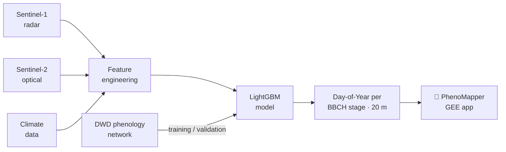

<div align="center">

# 🌾 PhenoMapper

### Interactive crop-phenology explorer for Germany (2017–2021) on Google Earth Engine

Companion web-app for the paper _“A novel fusion of Sentinel-1 and Sentinel-2 with climate data for crop phenology estimation using Machine Learning”_ (Shojaeezadeh, Elnashar & Weber, **Science of Remote Sensing**, 2025).

[](https://doi.org/10.1016/j.srs.2025.100227)
[](https://arxiv.org/abs/2409.00020)
[](https://earthengine.google.com/)
[](LICENSE)

</div>

---

## Overview

**PhenoMapper** turns the machine-learning phenology product of Shojaeezadeh et al. (2025) into an interactive, point-and-click map. A **LightGBM** model fuses **Sentinel-1** radar, **Sentinel-2** optical imagery and **high-resolution climate data** to predict **13 BBCH growth stages** for **8 major crops** across **Germany** at **20 m** resolution for **2017–2021**, validated against the German Meteorological Service (DWD) phenological network (**R² > 0.43**, **MAE ≈ 6 days**).

The app lets you:

- 🗺️ Compare a **Crop Type Map** (left) against the **predicted Day-of-Year** of any growth stage (right) in a synced, wipeable split map, over a selectable **basemap** (Satellite · Hybrid · Roadmap · Terrain).
- 🧮 Choose the **right-map layer**: single-stage Day-of-Year, **growing-season length** (emergence→maturity, in days), **5-year mean**, or **anomaly** (year − 5-year mean) — all derived on the fly from the data.
- 📅 Switch between years (2017–2021) and BBCH stages (00, 10, 51, 53, 87, 89), with a **layer-opacity slider**.
- 🎨 Choose a **scientific colorbar** (Viridis · Turbo · Magma · Seasonal); ranges use a **2–98% percentile stretch** (cached per view) with Day-of-Year **and** month tick labels, and a diverging palette for anomalies.
- 🖍️ **Highlight one crop** to show *only* that crop on **both** the crop-type map and the phenology map.
- 🖱️ **Click any field** — or **draw an area to average** — to read that field’s phenology.
- 📈 See a **smoothed BBCH development curve** (monotone-cubic PCHIP) on a real calendar-date axis, with **winter crops correctly starting in the previous autumn**.
- 🔁 Toggle a **full 5-year time series (2017–2021)** where **each season is coloured by that year’s crop**, revealing crop rotation, plus a per-season summary (crop, emergence → maturity, growing-season length).
- ⬇️ **Export the full time series to CSV** for the selected point or area (all years).
- 🌱 Understand the scale from a **generated crop-growth illustration** (sky, sun, soil, and wheat plants growing → heading → ripening → senescing).

---

## 🚀 Live app

<div align="center">

### ▶️ [**Launch PhenoMapper**](https://ee-shahab2710.projects.earthengine.app/view/phenomapper)

[](https://ee-shahab2710.projects.earthengine.app/view/phenomapper)

*No install needed — runs in your browser on Google Earth Engine.*

</div>

To publish your own copy, open [`src/phenomapper.js`](src/phenomapper.js) in the [Earth Engine Code Editor](https://code.earthengine.google.com/), import the required assets (below), then use **Apps → Publish**. See [Getting started](#-getting-started).

---

## ✨ Features in detail

| Panel | What it does |
|---|---|
| **What is BBCH?** | A **generated crop-growth illustration** — plants rising from the soil, forming an ear, ripening to gold and senescing — that conveys the BBCH lifecycle at a glance. |
| **Explore** | Year selector, BBCH stage selector, **right-map layer mode** (Day-of-Year · season length · 5-year mean · anomaly), scientific colorbar switcher, and a layer-opacity slider. Colorbar ranges come from fast per-stage defaults, so switching is instant. |
| **Crop layer** | Pick a crop and optionally **highlight it alone** on the Crop Type Map. |
| **Field profile** | Click a field or draw a polygon (area average). A **monotone-cubic (PCHIP)** smoothed curve plots BBCH stage vs. calendar date; predicted stages are overlaid as markers. Tick **“Show all 5 years”** to stack 2017–2021 on one axis with **each season coloured by that year’s crop** (crop rotation), plus a coloured per-season summary. |
| **Download CSV** | Exports the full series (`date, year, crop, day_of_year, bbch_smoothed, predicted_stage_bbch, stage_name, season_type`) for the selected point/area via a real Earth Engine download URL. |

### Winter vs. summer season logic

Each predicted stage’s day-of-year is anchored so the sequence is chronological: maturity is fixed to the season year, then earlier stages are walked backward — any stage whose day-of-year falls *later* than the next stage is assigned the **previous** calendar year. This automatically places **winter-cereal sowing and emergence in the previous autumn** (e.g. Oct 2016 → Jul 2017), while summer/spring crops stay within a single year.

---

## 🛰️ The science

| | |
|---|---|
| **Crops (8)** | Winter wheat, winter barley, winter rye, spring barley, spring oat, maize, sugar beet, winter rapeseed |
| **Growth stages** | 13 BBCH stages (app exposes 00 Sowing, 10 Emergence, 51 & 53 Heading, 87 Ripening, 89 Maturity) |
| **Inputs** | Sentinel-1 (VV/VH radar), Sentinel-2 (optical), high-resolution climate data |
| **Model** | LightGBM (gradient-boosted trees) with feature selection |
| **Reference data** | DWD German phenological network (2017–2021) |
| **Resolution / extent** | 20 m, Germany, 2017–2021 |
| **Accuracy** | R² > 0.43, MAE ≈ 6 days (mean over stages & crops) |



---

## 📂 Repository contents

```
PhenoMapper/
├── src/
│   └── phenomapper.js     # The complete Earth Engine app (paste into the Code Editor)
├── CITATION.cff           # Machine-readable citation ("Cite this repository")
├── LICENSE                # MIT (application code)
└── README.md
```

---

## 🧑‍💻 Getting started

1. Open the [Earth Engine Code Editor](https://code.earthengine.google.com/) (requires a free Earth Engine account).
2. Create a new script and paste the contents of [`src/phenomapper.js`](src/phenomapper.js).
3. Add the required **Imports** at the top of the script (see below).
4. Press **Run**. Use **Apps → Publish** to deploy it as a shareable web app.

### Required Earth Engine assets

The script expects three inputs. Update the paths to your own assets:

| Import name | Type | Description |
|---|---|---|
| `CTM` | `ImageCollection` | Crop Type Map; band `b1` holds the crop code (e.g. `1101` = winter wheat). |
| `FH` | `FeatureCollection` / `Geometry` | Frankenhausen study-site boundary (University of Kassel). |
| Phenology | `Image` assets | Predicted Day-of-Year rasters named `<year>_<bbch>` (e.g. `2017_51`) under `projects/ee-shahab2710/assets/Phenology/`, band `classification`. |

> The default asset root and study-site center (Frankenhausen, 9.44 °E / 51.41 °N) are set near the top of the script — change them for other regions or accounts.

---

## 📖 Citation

If you use this app or the underlying phenology product, please cite the paper:

> Shojaeezadeh, S. A., Elnashar, A., & Weber, T. K. D. (2025). **A novel fusion of Sentinel-1 and Sentinel-2 with climate data for crop phenology estimation using Machine Learning.** *Science of Remote Sensing*, 11, 100227. https://doi.org/10.1016/j.srs.2025.100227

<details>
<summary>BibTeX</summary>

```bibtex
@article{Shojaeezadeh_2025,
  title   = {A novel fusion of Sentinel-1 and Sentinel-2 with climate data for crop phenology estimation using Machine Learning},
  author  = {Shojaeezadeh, Shahab Aldin and Elnashar, Abdelrazek and David Weber, Tobias Karl},
  journal = {Science of Remote Sensing},
  volume  = {11},
  pages   = {100227},
  year    = {2025},
  month   = {June},
  issn    = {2666-0172},
  doi     = {10.1016/j.srs.2025.100227},
  url     = {https://doi.org/10.1016/j.srs.2025.100227},
  publisher = {Elsevier BV}
}
```
</details>

A preprint is also available: [arXiv:2409.00020](https://arxiv.org/abs/2409.00020).

---

## 👤 Author & contact

**Shahab Aldin Shojaeezadeh** — University of Kassel
📧 shahab@uni-kassel.de · [ORCID 0000-0003-3260-7141](https://orcid.org/0000-0003-3260-7141)

Co-authors: **Abdelrazek Elnashar** ([ORCID 0000-0001-8008-5670](https://orcid.org/0000-0001-8008-5670)), **Tobias Karl David Weber** — University of Kassel.

---

## 🙏 Acknowledgements

- Phenological reference data: **Deutscher Wetterdienst (DWD)** German phenological network.
- Imagery: **Copernicus Sentinel-1 & Sentinel-2** (ESA/EU); processed on **Google Earth Engine**.
- Colorbar utilities: [`users/gena/packages:palettes`](https://github.com/gee-community/ee-palettes).

---

## 📄 License

The application code in this repository is released under the [MIT License](LICENSE). The associated scientific data products and publication are subject to their own terms — please refer to the paper and the respective data providers.
